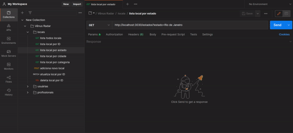
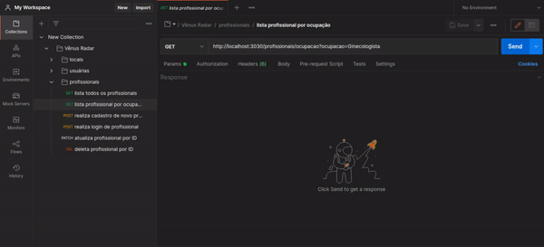
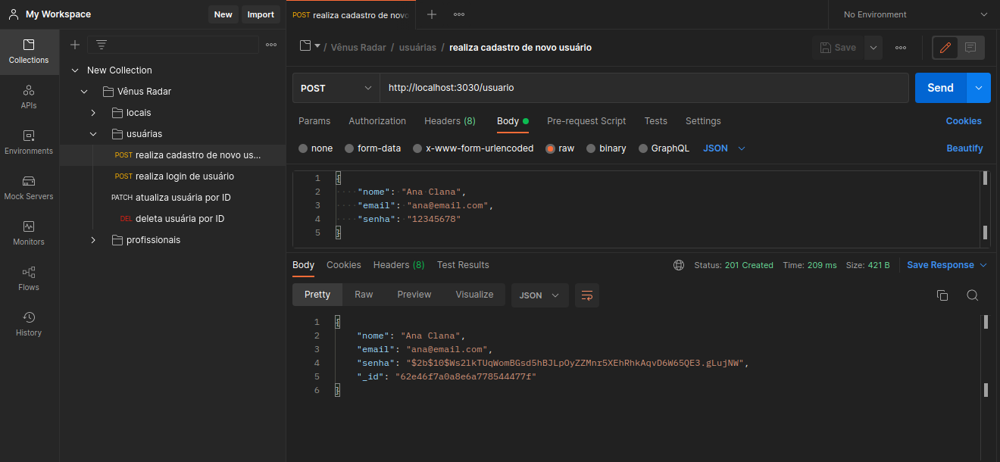
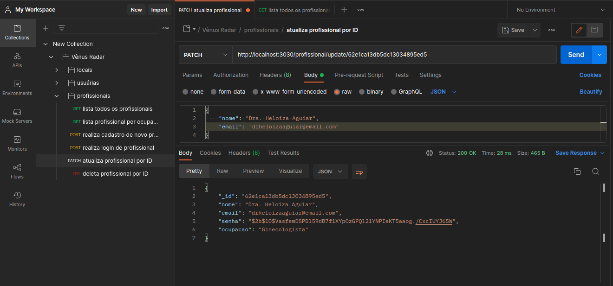
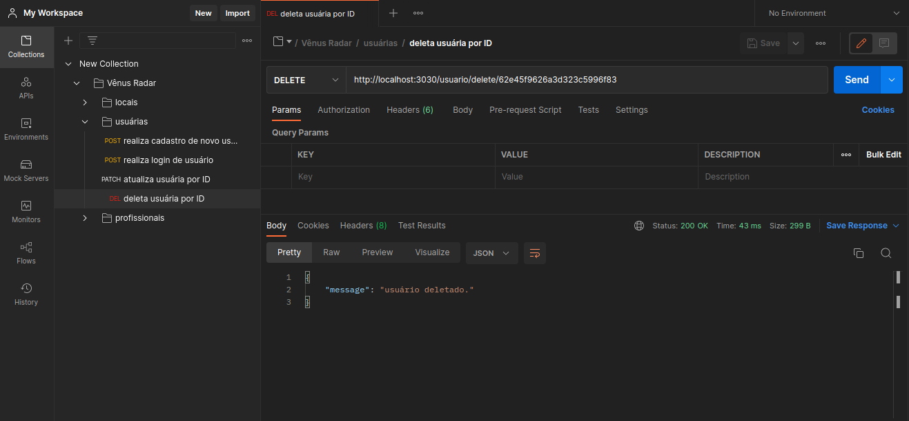

# 
♀️ Vênus Radar

 
 

</h1> 

## 
🌼 Vênus Radar é uma API e Banco de Dados com CRUD completo, MongoDB, Autenticação e Login. Projeto final do curso Todas em Tech de Desenvolvedora Backend | Turma On16 [{Reprograma}](https://www.reprograma.com.br/).

### 📍 Sumário:
- [♀️Vênus Radar](https://github.com/Sara-Giannini/projeto-final-Venus-Radar-#-Vênus-Radar)
- [📁 Arquitetura Final](https://github.com/Sara-Giannini/projeto-final-Venus-Radar-#-Arquitetura-Final)
- [💻 Tecnologias e Dependências Utilizadas](https://github.com/Sara-Giannini/projeto-final-Venus-Radar#-Tecnologias-e-Depend%C3%AAncias-Utilizadas)
- [🪄 Preparando o Ambiente Para o Projeto](https://github.com/Sara-Giannini/projeto-final-Venus-Radar-#-Preparando-o-Ambiente-Para-o-Projeto)
- [🔓 Interface Gráfica Para Realizar os Testes de Rotas](https://github.com/Sara-Giannini/projeto-final-Venus-Radar#-Interface-Gr%C3%A1fica-Para-Realizar-os-Testes-de-Rotas)
- [🔒 Preparando o Ambiente Para Autenticação](https://github.com/Sara-Giannini/projeto-final-Venus-Radar-#-Preparando-o-Ambiente-Para-Autentica%C3%A7%C3%A3o)
- [🔐 Testando Rotas de Login e Proteção das Rotas](https://github.com/Sara-Giannini/projeto-final-Venus-Radar-#-Testando-Rotas-de-Login-e-Prote%C3%A7%C3%A3o-das-Rotas)
- [👩🏻‍🦰 Autora](https://github.com/Sara-Giannini/projeto-final-Venus-Radar-#-Autora)

## ♀️Vênus Radar

A violência Obstétrica e Ginecológica, assim como em outras áreas da saúde como em exames preventivos é muito recorrente. Sejam agressões físicas, psicológicas, moral, abusos, violação, preconceitos, racismo ou trabsfobia. Infelizmente, muitas dessas agressões são silenciadas ou até mesmo desacreditadas.
O projeto Vênus Radar tem como objetivo a criação de um banco de dados e API, ao qual a pessoa usuária pode se cadastrar com e-mail e senha, incluir a Clínica ao qual sofreu a violência anonimamente a fim de encorajar denúncias, bem como listar Clínicas por cidade, estado ou categoria (Obstétrica , Ginecológica, etc), com a finalidade de alertar outras pessoas pacientes e buscar uma rede de apoio. Além disso, a API conta com uma busca por profissionais voluntários, aos quais podem se cadastrar com e-mail e senha informando sua ocupação (Obstetra, Ginecologista, Psicólogo, etc) a fim de oferecer auxílio e apoio médico e psicológico para as vítimas, oferecendo à pessoa usuária uma busca por profissionais de acordo com a ocupação que a mesma necessita.

 ## 📁 Arquitetura Final
        
        📂--projeto-final-Venus-Radar
            |
            |--📁~node_modules~
            |
            |--📂 src
            |  ||
            |  ||
            |  ||--📂 controllers
            |  |    |- 📄 locaisController.js
            |  |    |- 📄 profissionaisController.js
            |  |    |- 📄 usuariosController.js
            |  |
            |  ||--📂 database
            |  |    |- 📄 mongooseConnect.js
            |  |
            |  ||--📂 models
            |  |    |- 📄 locaisModels.js
            |  |    |- 📄 profissionaisModels.js
            |  |    |- 📄 usuariosModel.js
            |  |
            |  ||--📂 routes
            |  |    |- 📄 locaisRoutes.js
            |  |    |- 📄 profissionaisRoutes.js
            |  |    |- 📄 usuariosRoutes.js
            |  |
            |  ||-📄 app.js
            |  |
            |  |--📂 swagger
            |  |   |- 📄 swagger_output.json
            |  |
            |  |
            |- 📄 ~.env~
            |- 📄 .env.example
            |- 📄 .gitignore
            |- 📄 package-lock.json
            |- 📄 package.json
            |- 📄 Procfile
            |- 📄 README.md
            |- 📄 server.js
            |- 📄 swagger.js

## 💻 Tecnologias e Dependências Utilizadas

Ferramenta | Descrição
-- | --
javascript | Linguagem de programação.
node.js | Ambiente de execução do javascript.
express | Framework NodeJS.
mongoose | Dependência que interage com o MongoDB para a conexão da database, criação do model e das collections.
nodemon | Dependência que observa as atualizações realizadas nos documentos para rodar o servidor automaticamente.
npm ou yarn | Gerenciador de pacotes.
MongoDb | Banco de dados não relacional orietado a documentos.
Mongo Atlas | Interface gráfica para verificar se os dados foram persistidos.
Postman | Interface gráfica para realizar os testes de rotas.
jsonwebtoken | Dependência que implementa o protocolo JSON Web Token.
bcrypt | Bcryptjs é uma biblioteca para encriptação de dados. Neste caso, o dado a ser criptografado é o password.
dotenv | Dependência  para gerenciar facilmente variáveis de ambiente, não é  obrigatório para JWT, mas uma boa prática para configurações em geral.
swagger | Gera a documentação.
heroku | hospeda a documentação.

## 🪄 Preparando o Ambiente Para o Projeto
📍 Para executar este projeto, é necessário ter instalado o Node.js e as dependências do npm.
- Clonar este repositório através do comando no terminal:
- `git clone https://github.com/Sara-Giannini/projeto-final-Venus-Radar.git`
- Entre na pasta do repositório e no terminal execute:
- `npm init -y`
- `npm install `
- `npm install express `
- `npm install nodemon `
- `npm install mongoose `
- `npm i --save-dev dotenv`
- `npm install jsonwebtoken --save`
- `npm install bcrypt --save`
- Inicialize com o comando `npm start` para executar o servidor localmente.

## 🔓 Interface Gráfica Para Realizar os Testes de Rotas

📍 Este projeto está com os métodos HTTP organizados. Você pode testar as rotas Get, Post, Patch e Delete através de qualquer ferramenta cliente API REST, como Insomnia, Thunder Client, [Postman](https://www.postman.com/downloads/), entre outros. Nesse projeto, utilizamos o Postman.

### - GET

Retorna todos os locais `http://localhost:3030/locais`

 
 

</h1> 

Retorna todos os locais por estado `http://localhost:3030/estados?estado`

 
 

</h1> 

Retorna todos os profissionais por ocupação `http://localhost:3030/profissionais/ocupacao`

 
 

</h1> 

### - POST

Realiza cadastro de novo usuário `http://localhost:3030/usuario`

 
 

</h1> 

### - PATCH

Atualiza profissional por ID `http://localhost:3030/profissional/update/:id`

 
 

</h1> 

### - DELETE

Deleta usuário por ID `http://localhost:3030/usuario/delete/:id`

 
 

</h1> 

## 🔒 Preparando o Ambiente Para Autenticação
⚠️ Criar arquivo `.env` (adicionar no `.gitignore`) e usar o arquivo `.env.example` como modelo, colocando assim os seus dados.

Seguir a ordem de instalações no terminal:

   Inicialize o comando de instalação `npm i express cors` para instalar o cors.
   Inicialize o comando de instalação `npm i --save-dev dotenv` para instalar dontenv.
   Inicialize com o comando `npm start` para que você possa executar os testes.

## 🔐 Testando Rotas de Login e Proteção das Rotas

📌 Todas as rotas do projeto:

- ### Locais
Verbo | EndPoint | Descrição da Rota | Status | Auth
-- | -- | -- | -- | --
GET | /locais | Retorna todos os locais | 200 | ❌
GET | /locais/:id | Retorna local por ID | 200 | ❌
GET | /estados | Retorna local por estado | 200 | ❌
GET | /cidades | Retorna local por cidade | 200 | ❌
GET | /categoria | Retorna local por categoria | 200 | ❌
POST | /novo/local |Adiciona novo local | 201 | ❌
PATCH | /local/update | Atualiza local por ID | 200 | ✔
DELETE | /local/delete/:id | Deleta local por ID | 200 | ✔

- ### Pessoas Usuárias

Verbo | EndPoint | Descrição da Rota | Status | Auth
-- | -- | -- | -- | --
POST | /usuario | Realiza cadastro de nova pessoa usuária | 201 | ✔
POST | /usuario/login | Realiza login e retorna token de usuário| 200 | ✔
PATCH | /usuario/update/:id | Atualiza pessoa usuária por ID | 200 | ✔
DELETE | /usuario/delete/:id | Deleta pessoa usuária por ID | 200 | ✔

- ### Profissionais 

Verbo | EndPoint | Descrição da Rota | Status | Auth
-- | -- | -- | -- | --
GET | /profissionais | Retorna todos os profissionais | 200 | ❌
GET | /profissionais/ocupacao | Retorna Profissionais por ocupação | 200 | ❌
POST | /profissional | Realiza cadastro de novo profissional | 201 | ✔
POST | /profissional/login | Realiza login e retorna token de profissional | 200 | ✔
PATCH | /profissional/update/:id | Atualiza profissional por ID | 200 | ✔
DELETE | /profissional/delete/:id | Deleta profissional por ID | 200 | ✔

# 
✨ Muito obrigada por chegar até aqui ✨

 
 

</h1> 

## 👩🏻‍🦰 Autora

 
 

</h1> 

Desenvolvido por 

 
 

</h1> 

